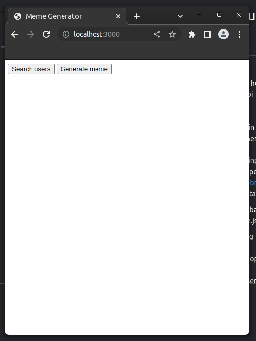
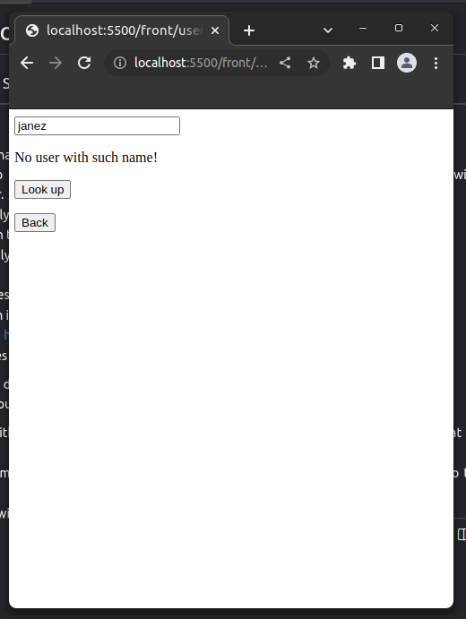
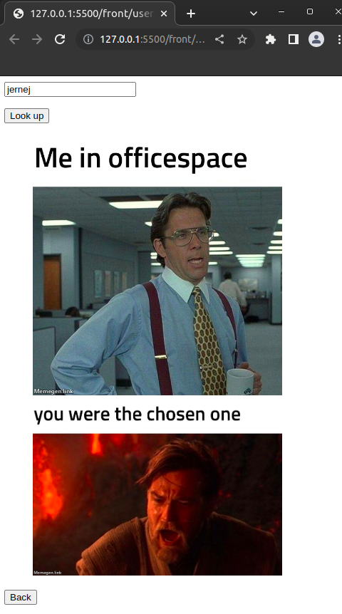
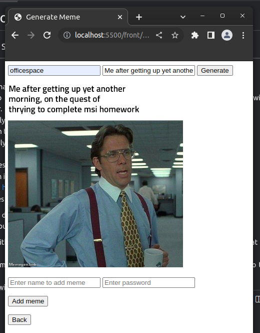
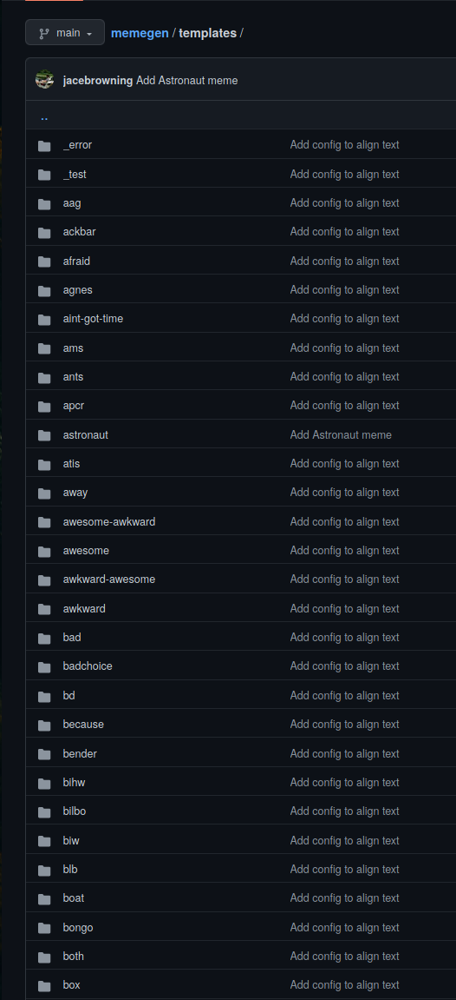

# Homework 1 msi course 
### Author: Irinej Slapal
___
## Project:

I didn't know what project to deploy for homework,   
so I decided to create a very basic api with python and django framework, that interacts with a frontend server, and maybe learn some web developing.  
Which eventually took me way longer than I thought it would,  
as it was my first time creating a web server,  
being completely new to web development.  
 
My api generates a url-string from user input (template and text),  
which acts as an input/request for the opensource memegen api  
by jace browing https://github.com/jacebrowning/memegen.  
Which generates the image from the data in the url.

The idea was to deploy 2 VMs, 1 for the backend (that takes the input and generates the url),  
and one that would run a frontend node.js server.  
 
### Ui:

The user can either look up an existing user by username, which displays all the memes that user generated.  
Or generate a meme, after which the option is then given for the user, to add the meme to their profile,  
and the meme will be visible to other users when they do a lookup on them.  
 
If the user chooses to add a meme, it will be required of him to enter their username and password,  
which will create a profile in database on django server, or if the user already has a profile,   
will just add the meme to their profile.
 
The backend and frontend exchange url links, and the image is displayed on frontend,  
once the request is sent and the data recived from the opensource memegen api.

 
 
The templates are available on the github page:
 

___
## Vagrant:
 
I wrote a configuration in Vagrantfile that sets up 2 virtual machines:  

one that runs the frontend server and one that runs the backend server.  
 
I enabled port forwarding on the boxes, so the setup in a local environment.  
I set up the .service file to run the server in the background.  
Configuration is almost the same for both virtual machines.  
Here the redirection links between the html pages for the front end mostly arent working on my setup,   I did not figure out why yet.  
Vagrant file is included in the repository.
 
 
 
___
## Cloud-init

I wrote a similar configuration for the cloud-init and multipass.  
However I have troubles uploading the directory to the virtual machine.
I have tried to clone my private github repository, but the vm would not detect the deploy ssh key.
I have tried with wite_files, but as I understand it I would have to write the whole repository manually in the cloud-init config file.  
Multipass transfer and mount commands were also not working for me, when i tried to get the project  files to the vm and test if the server works.

<04/02/2023> Samo commital, ko sem oddal 2. nalogo, sem v aplikaciji popravil linke za redirekcijo za html page na front end