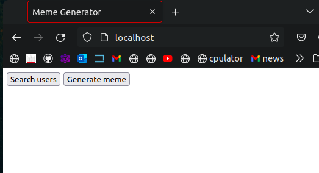
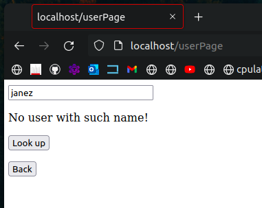
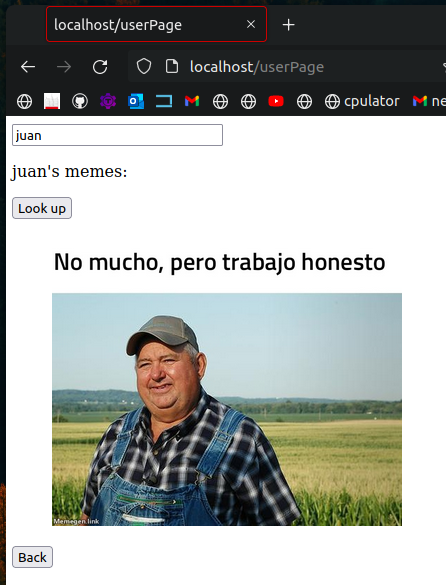
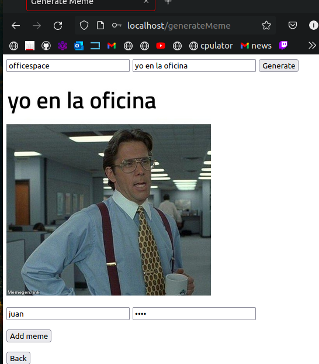
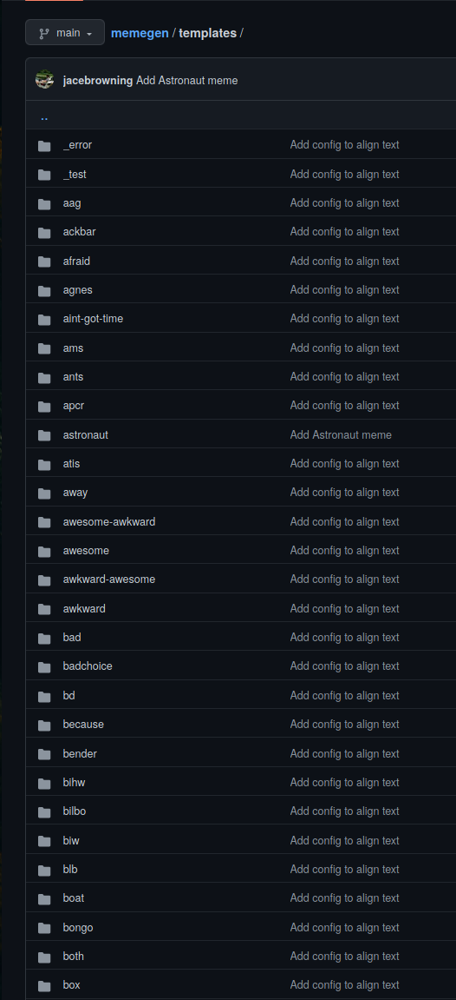
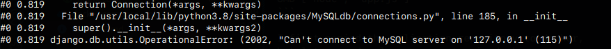
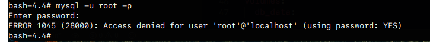
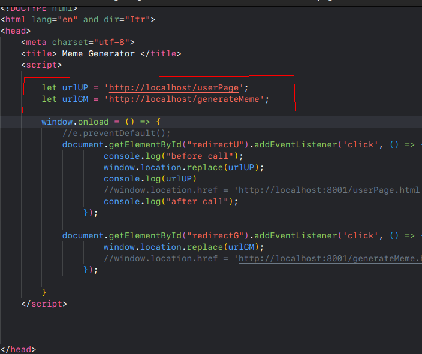
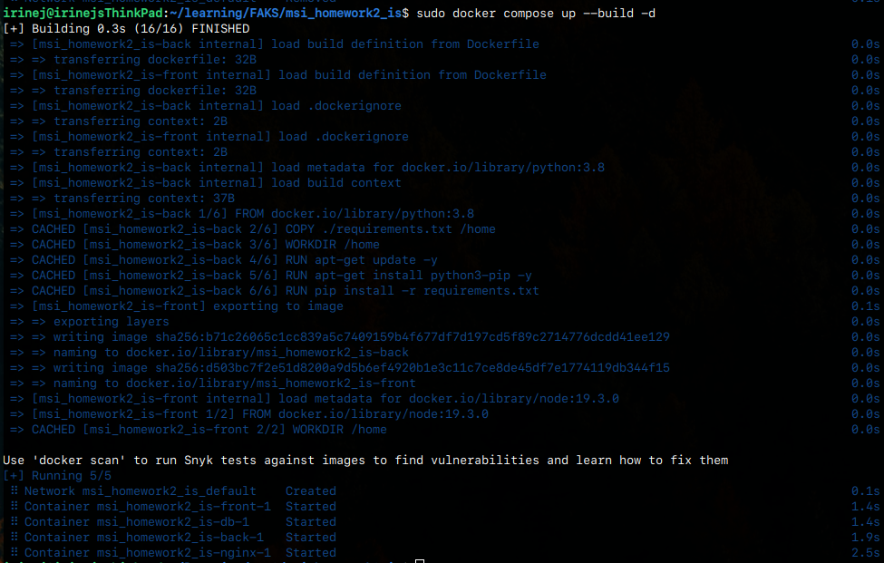

# Homework 2 msi course 
### Author: Irinej Slapal
___
## Short project description:

The project is the same as in the first homework and runs locally on machine.  
A simple api with django, that generates urls as inputs for the  opensource  
memegen api: "https://github.com/jacebrowning/memegen".

</br>

### Ui:

Frontend has 3 pages:  
    - home  
    - one where user generates a meme  
    - and one where user looks up other peoples memes





</br>
</br>
The template names are available on the github page:  
https://github.com/jacebrowning/memegen

</br>



### Backend:
the backend generates the url from input of the user  
    and sends it to the frontend on request.


```py
@csrf_exempt
def generate_meme(request):
    if request == None:
        response = json.dumps([{"Error": "no body"}])
        return HttpResponse(response, content_type='text/json')

    body = json.loads(request.body.decode('utf-8'))
    template = body["template"]
    text = modify(body["text"])

    imageUrl = "https://api.memegen.link/images/"
    imageUrl += template+"/"+text+".jpg"+"?layout=top"
    response = json.dumps({'meme': imageUrl})
    return HttpResponse(response, content_type='application/json')
```

___
## Docker compose:

The docker-compose deploys 4 containers:  
- frontend container (nodejs/html)  
- backend container (django)  
- database container (postgres)  
- nginx container as a reverse proxy

The frontend and backend container are build from Dockerfiles,  
the database and reverse proxy containers are built directly from docker-compose.

### Front and back:

```Docker
FROM python:3.8

# Copy the requirements file
COPY ./requirements.txt /home

# Set the working directory
WORKDIR /home

# Install pip
RUN apt-get update -y
RUN apt-get install python3-pip -y

# Install the dependencies
RUN pip install -r requirements.txt


EXPOSE 8000
```

```Docker
FROM node:19.3.0

#COPY . /home

# Set the working directory
WORKDIR /home

EXPOSE 3000

# Start nodejs server 

CMD ["node", "app.js"]
```

I first copied the aplication repository to docker,  
but later used volumes parameter in docker-compose.
___

### Database:

I had trouble with deploying the database in a seperate container.  
First I went with mysql, but mysql would not grant me acces even-tho i defined  
the user and password in the docker-compose and later when i tried to launch it with Dockerfile aswell. 

```Docker
FROM mysql:8

ENV MYSQL_DATABASE users
ENV MYSQL_USER django
ENV MYSQL_PASSWORD djangopw
ENV MYSQL_ROOT_PASSWORD adminadmin

COPY ./data.sql /docker-entrypoint-initdb.d/data.sql
```




I then moved to postgres and had a lot less trouble.

</br>

### Nginx:
I configured the nginx server in nginx.conf to run on port 80,  
 and then forward requests on back:8000 or front:3000.   
I had to edit the urls in the project for the configuration to work.  

Like here in index.html:




```
include /etc/nginx/moodules-enabled/*.conf;

events {
    worker_connections 1024;
}


http {
    server {
        listen 80;
        server_name localhost 127.0.0.1;

        location /api {
            proxy_pass http://back:8000;
            proxy_set_header X-Forwarded-For $remote_addr;
        }

        location / {
            proxy_pass http://front:3000;
            proxy_set_header X-Forwarded-For $remote_addr;
        }
    }
}
```
```yml
 nginx:
    image: nginx
    
    depends_on:
      - front
      - back
      - db
      
    volumes:
      - ./nginx/nginx.conf:/etc/nginx/nginx.conf
    ports:
      - 80:80
```


When I run the command "sudo docker compose up --build -d",   
the containers are built and launched and the whole configuration is operational.




